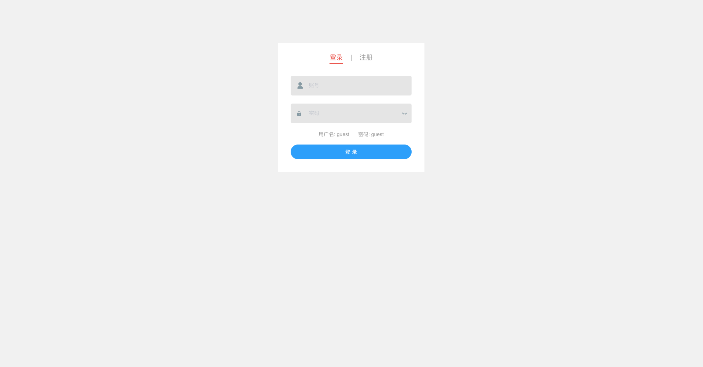
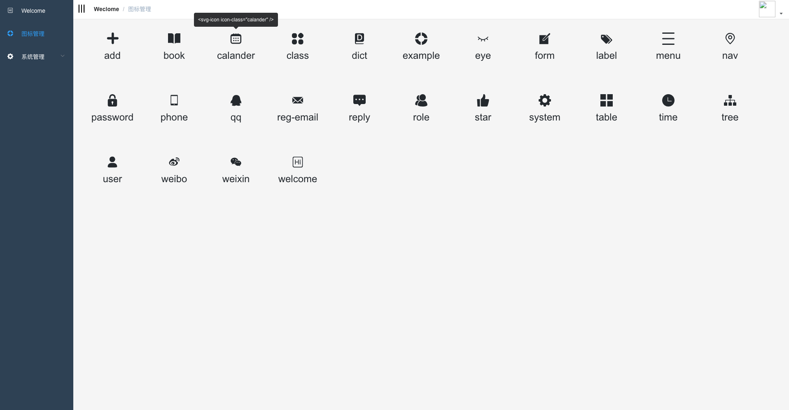
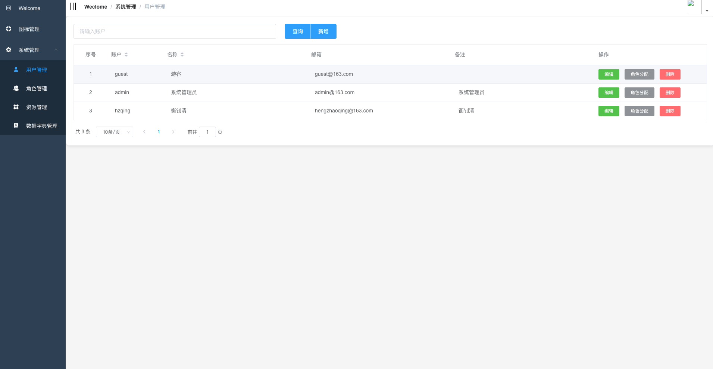
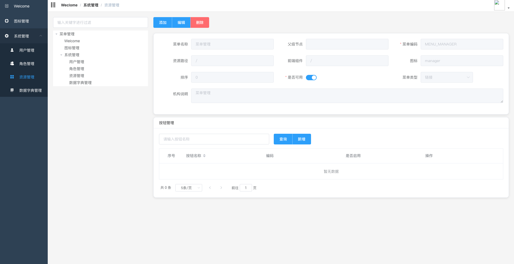
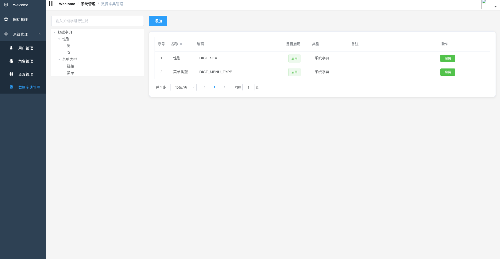

# 代码在重构中,请暂时不要使用,重构完成时间大约 2018年11月15日

# HZQ-Admin(开源版)

> 基于Spring Boot，Vue的单体应用后台管理系统
## 使用环境
- Jdk 1.8

- Mysql 5.6

- Docker (可选)

## 使用技术
- Spring boot 2.0.0

- mybatis 3.4.5 

- Spring 4.3.12

- Spring MVC 4.3.12

- Maven

- Vue

- Element ui

## 功能

- 用户管理 （完成）

- 角色管理 （完成）

- 字典管理 （完成）

- 菜单管理 （完成）

- 按钮管理 （完成）

- 图标管理 （完成）

- 权限管理  (完成)

- 登录拦截 （完成)

[点击查看](http://www.hzqing.com)

# 更新日志

- 2018-06-12 完善图标管理，菜单管理，按钮管理,登录拦截
- 2018-05-26 重构完用户管理，角色管理
- 2018-05-23 项目基础构建完成

# 功能截图

# MIT License

